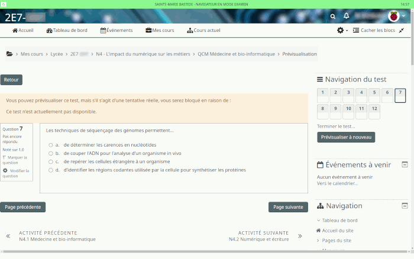

    

Navigateur Web ultra simplifié avec mode examen pour l'Ensemble Scolaire Sainte-Marie Bastide à Bordeaux.
Il est utilisé avec le module de QCM en ligne Moodle (activité *test*) en salle informatique sous la surveillance de l'enseignant.

Fonctionnalités principales :

* Une seule fenêtre, aucun réglage possible
* Détection de la perte de focus : le navigateur web se bloque et nécessite l'appel du surveillant pour la débloquer.
* URL pré-configurée, aucune sortie du domaine n'est autorisée
* Icone pour revenir à l'URL d'accueil
* Horloge permanente
* Pas de barre d'adresse ni de recherche
* Pas de téléchargement de documents autres que HTML, CSS, JS et les images
* Raccourcis clavier désactivés

Autonome (*standalone*), il ne nécessite aucune installation. Il peut être placé sur une clé USB, mais **pas sur un lecteur réseau Microsoft Windows** (*mapped drive* = dll non chargées).

La sortie du programme et l'entrée du code de déverrouillage se font respectivement par un clic droit et clic gauche sur l'horloge.

Vous pouvez configurer le navigateur en éditant le fichier ExamWebBrowser.ini créé au premier lancement.

    

Téléchargement des binaires : <a href='https://smb33.keosystems.com/ewb/' target='_blank'>https://smb33.keosystems.com/ewb/</a>
