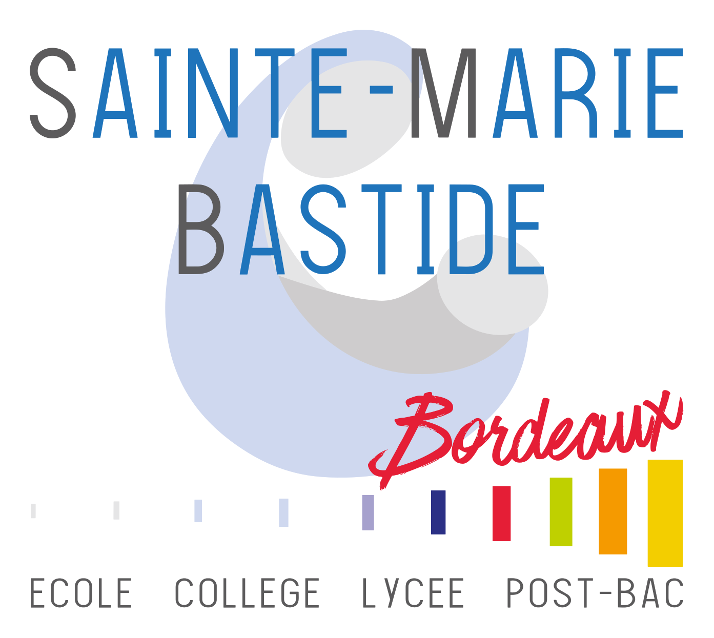
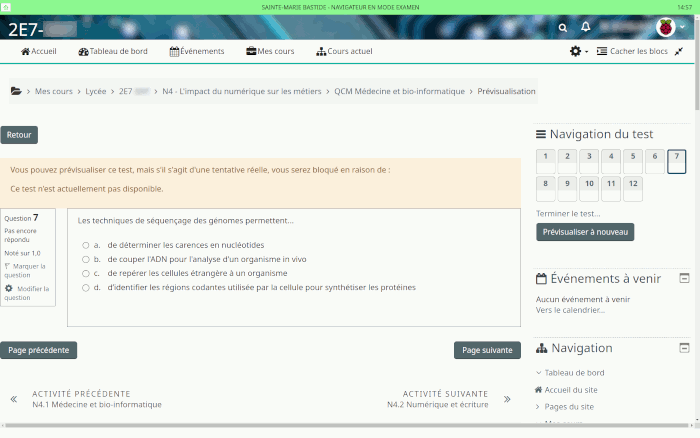

<p align="center">
    <a href='https://www.smb33.fr/' target='_blank'></a>
</p>

Navigateur web simplifié avec mode examen, conçu pour l'Ensemble scolaire Sainte-Marie Bastide à Bordeaux. Il est utilisé avec l'activité « test » (QCM en ligne) de Moodle, en salle informatique, sous la surveillance de l'enseignant.

> [!CAUTION]
> Le programme doit être lancé à partir d'un stockage local.
>
> Il ne fonctionne pas depuis un lecteur réseau Windows en raison des restrictions de chargement des DLL.

## Fonctionnalités principales

| | Fonctionnalité |
|---|---|
| 🖥️ | Une seule fenêtre en plein écran, sans bouton de fermeture ni réglage possible |
| 👁️ | Détection de la perte de focus : le navigateur se bloque et nécessite l'intervention du surveillant |
| 🔒 | URL préconfigurée, aucune sortie du domaine autorisée |
| 🏠 | Bouton d'accueil pour revenir à l'URL de départ |
| 🕐 | Horloge permanente |
| 🚫 | Pas de barre d'adresse ni de recherche |
| 📄 | Aucun téléchargement hormis les ressources web (HTML, CSS, JS, images) |
| ⌨️ | Raccourcis clavier désactivés |
| 🎓 | **Plugin Moodle** : restriction d'accès aux tests pour n'autoriser qu'ExamWebBrowser |

## Installation

L'application est autonome et ne nécessite aucune installation. Elle peut être placée sur une clé USB, mais **pas sur un lecteur réseau Microsoft Windows** (les DLL ne sont pas chargées depuis un *mapped drive*).

## Configuration

Le navigateur se configure en éditant le fichier `ExamWebBrowser.ini`, créé automatiquement au premier lancement.

- **Clic droit sur l'horloge** : quitter le programme
- **Clic gauche sur l'horloge** : saisir le code de déverrouillage

<p align="center">
    <a href='https://www.smb33.fr/' target='_blank'></a>
</p>

## Plugin Moodle (quizaccess_ewb)

Un plugin Moodle de type *quiz access rule* est fourni dans le dossier `moodle-plugin/`. Il permet de restreindre l'accès à une activité « test » aux seuls élèves utilisant ExamWebBrowser, à la manière de Safe Exam Browser (SEB).

### Fonctionnement

ExamWebBrowser envoie un *User-Agent* contenant `ExamWebBrowser/1.0`. Le plugin Moodle vérifie la présence de cette chaîne et bloque l'accès au test si elle est absente. Les enseignants et les administrateurs sont automatiquement exemptés de cette vérification.

### Installation sur Moodle 4.x

1. Récupérer l'archive `moodle-plugin/quizaccess_ewb.zip`
2. Dans Moodle, accéder à **Administration du site > Extensions > Installer des extensions**
3. Déposer l'archive et suivre les étapes de validation
4. Moodle installe le plugin et met à jour la base de données

### Utilisation

1. Modifier un test dans Moodle
2. Dans les paramètres du test, activer l'option **Exiger ExamWebBrowser**
3. Les élèves utilisant un navigateur classique verront un message d'erreur
4. Les élèves utilisant ExamWebBrowser pourront passer le test normalement

## Compilation

```bash
./build_Linux.sh
```

L'exécutable est généré dans `build/linux/`.

## Téléchargement

Les paquets Linux (`.deb`) et Windows (`.zip`) sont générés automatiquement à chaque release via GitHub Actions.

Téléchargement depuis les **[Releases GitHub](https://github.com/obook/ExamWebBrowser/releases)**.

### Linux (.deb)

```bash
sudo dpkg -i examwebbrowser_*.deb
sudo apt-get -f install   # pour les dépendances Qt6
```

L'application est installée dans `/opt/examwebbrowser/` avec un lien `/usr/bin/examwebbrowser` et une entrée dans le menu des applications.

### Windows (.zip)

Extraire l'archive et lancer `ExamWebBrowser.exe`. Toutes les DLL Qt sont incluses ; aucune installation n'est requise.
