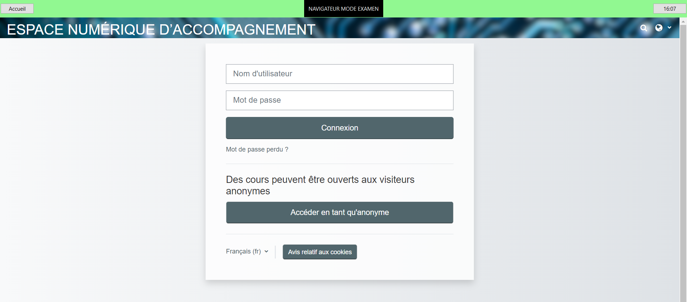

    

Navigateur Web avec mode examen pour l'ensemble scolaire Sainte-Marie Bastide à Bordeaux.

Fonctionnalités ultra simplifiées :
* pas de barre d'adresse
* URL préconfigurée
* raccourcis clavier désactivés
* pas de téléchargement de documents
* contrôle de perte de focus avec bouton d'appel du surveillant.

    

