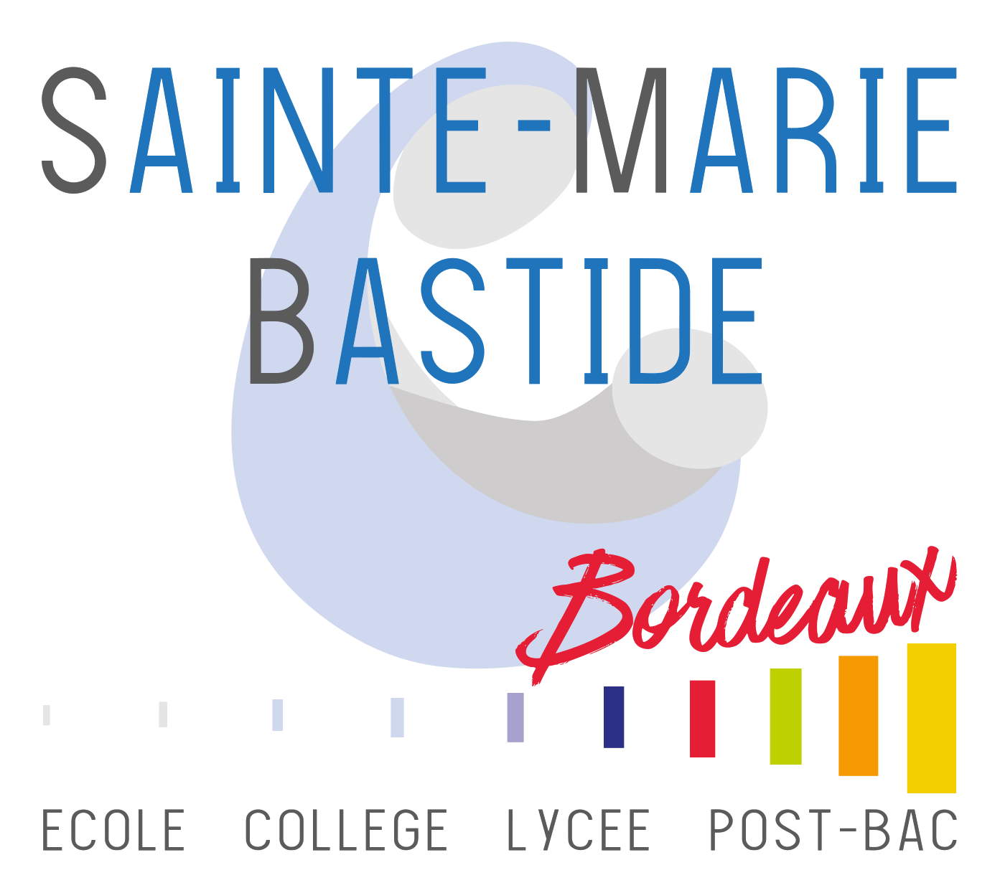

    

Navigateur Web avec mode examen pour l'Ensemble Scolaire Sainte-Marie Bastide à Bordeaux.

Fonctionnalités ultra simplifiées :
* pas de barre d'adresse
* URL préconfigurée
* raccourcis clavier désactivés
* pas de téléchargement de documents
* contrôle de perte de focus avec bouton d'appel du surveillant.

La sortie du programme et l'entrée du code de déverrouillage se sont par un clic droit sur l'horloge.

Vous pouvez configurer le logiciel en éditant le fichier ExamWebBrowser.ini créé au premier lancement.

    

